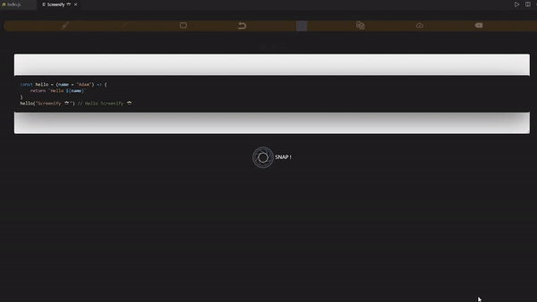
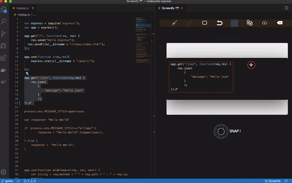
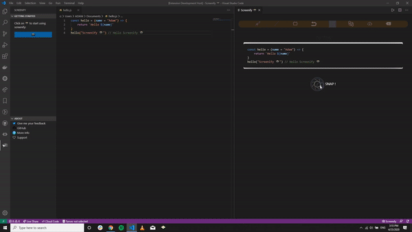

<h1 align="center">
   
  
   
  Screenify
   
</h1>

<h4 align="center"> Screenify your code</h4>

  
  
  
  

## Features

- Quickly save screenshots of your code
- Copy screenshots to your clipboard
- Draw over your screenshot.
- Upload your image online.

## Getting Started

-  <a href="https://code.visualstudio.com/shortcuts/keyboard-shortcuts-linux.pdf">Linux</a> `Ctrl+Shift+S`
-  <a href="https://code.visualstudio.com/shortcuts/keyboard-shortcuts-macos.pdf">macOS</a> `⌘Shift+S`
-  <a href="https://code.visualstudio.com/shortcuts/keyboard-shortcuts-windows.pdf">Windows</a> `Ctrl+Shift+S`

**Tips**:

- You can also start secreenify by clicking on the camera icon 📸 on the statusbar.
- Default key binding to start Screenify is `Ctrl+Shift+S` or `⌘Shift+S` If you'd like to bind screenify to another hotkey, open up your keyboard shortcut settings and bind `screenify.activate` to a custom keybinding.
- If you'd like to copy to clipboard instead of saving, click the image and press the copy keyboard shortcut (defaults are Ctrl+C on Windows and Linux, Cmd+C on OS X).

## Example

[Nord](https://github.com/arcticicestudio/nord-visual-studio-code) + [Input Mono](http://input.fontbureau.com)

[Monokai Pro](https://marketplace.visualstudio.com/items?itemName=monokai.theme-monokai-pro-vscode) + [Operator Mono](https://www.typography.com/blog/introducing-operator)

[Material Theme Palenight](https://marketplace.visualstudio.com/items?itemName=Equinusocio.vsc-material-theme) + [Fira Code](https://github.com/tonsky/FiraCode)

## Demo

### *Capture a snippet of your code*

### Draw over your snippet

Sketch, draw, and highlight your code for better explaination for others.

### *Upload your captured snippet online*
  

Share your code snippets online, screenify uploads your images that you can share the image url with others.

### *Save your captured snippet on your local directory*

Save your code as an image on your local machine directory.

## Known Issues

>Note: drawing experiense is stil little bit laggy and not smooth and it's still in development.

## Tip

- When running out of horizontal space, try the command `View: Toggle Editor Group Vertical/Horizontal Layout`.

## Credit

Thanks to the great Polacode.

Many color are taken from the elegant [Nord](https://github.com/arcticicestudio/nord) theme by [@arcticicestudio](https://github.com/arcticicestudio).

Download button animation is made with [Vivus](https://github.com/maxwellito/vivus).

Special Thanks to [SougCrypto](https://github.com/Soug-crypto) for helping out with desgin concepts of the MVP.

## Contributing

Please, report issues/bugs and suggestions for improvements to the issue [here](https://github.com/screenify/screenify-vscode/issues).

We're not users of Light versions so we need help to make light versions better. Please contribute if you have any suggestions. **PRs are welcomed!** :rocket:

Copyright (C) 2020 by [AM](https://github.com/adammomen)
-----------------------------------------------------------------------------------------------------------
***Enjoy! Screenifying 📸***
